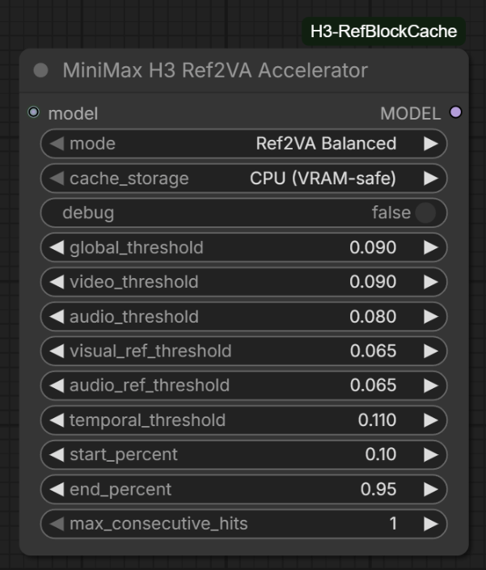

# ComfyUI MiniMax H3 Ref2VA Accelerator

Quality-first block-cache acceleration for native ComfyUI MiniMax H3 Ref2VA workflows.



Version **0.4.2** is the production-cleanup release. It keeps the v0.4 robustness work and the explicit v0.4.1 tail selector, but makes the experimentally validated production path unmistakable: **Balanced + CPU (VRAM-safe) + Safe CPU + tail_rescale OFF**. Experimental tail controls remain available under Advanced for benchmarking and research. The original ComfyUI node class ID is preserved, so workflows created with v0.1–v0.4.1 upgrade in place.

> [!IMPORTANT]
> This is an approximate accelerator, not bit-identical inference. For exact native behavior, bypass the node or use **Observe Only (no caching)**.

## Production defaults

For the validated quality-first BF16 workflow, use:

- **Mode:** Ref2VA Balanced
- **Cache storage:** CPU (VRAM-safe)
- **CPU tail compute:** Safe CPU (v0.3 behavior)
- **tail_rescale:** OFF
- **debug:** OFF

These defaults preserve maximum VRAM headroom while retaining the measured block-cache speedup. The Auto GPU Fast Path and tail rescale controls are retained under Advanced for experiments, not as recommended production settings.

## Highlights

- Built specifically for native ComfyUI `MiniMaxH3Model` Ref2VA layouts.
- Uses Ref2VA-aware global, video, audio, reference, and temporal guards, all accumulated in fp32.
- Runs transformer block 0 every step and conditionally reuses the blocks 1-49 residual.
- Prevents consecutive cache hits in every built-in quality preset.
- Defaults to the validated production path for VRAM-constrained BF16 workflows: CPU cache storage + Safe CPU tail compute.
- Detects incompatible DiT/block-cache patches instead of silently stacking them.
- Preserves compatibility with object-level attention patches such as SageAttention.
- Reports clearly when it is idle (no Ref2VA payload) or when a required guard metric is unavailable, and keeps loading even if `comfy.model_prefetch` disappears in a future ComfyUI.
- Ships a headless test suite (`python tests/test_runtime.py`; no ComfyUI or GPU required).

## Tested performance

Primary test: 10-second Ref2VA generation, 32 GB RTX 5090, pruned BF16 MiniMax H3, Sage-style attention, 20-step RES Multistep.

| Mode | Sampling time | Cached steps | Guidance |
| --- | ---: | ---: | --- |
| Native | ~14:43 | 0/20 | Exact native trajectory |
| Ref2VA Conservative | ~12:06 | 4/20 | Smaller observed differences |
| Ref2VA Balanced | ~11:05 | 5/20 | Recommended production compromise |
| Ref2VA Aggressive | ~10:32 | 6/20 | Experimental; more visible drift |

These figures describe one tested workflow, not a universal benchmark. Hardware, checkpoint, video length, resolution, sampler, offloading, and input content all affect results.

## Installation

### ComfyUI Manager

Once the node is listed in ComfyUI Registry/Manager, search for **H3 Ref2VA Accelerator**, install it, and restart ComfyUI.

### Manual installation

From your ComfyUI `custom_nodes` directory:

```bash
git clone https://github.com/BMB12d3/ComfyUI-H3-Ref2VA-Accelerator.git
```

Restart ComfyUI after installation. The node has no additional Python dependencies beyond ComfyUI and PyTorch.

### Upgrading from an older ZIP install

Existing workflows remain compatible because the original ComfyUI node class ID is preserved. If you previously installed a legacy ZIP whose folder is named `ComfyUI-H3-RefBlockCache`, remove or rename that old folder before installing/cloning `ComfyUI-H3-Ref2VA-Accelerator`. Do not keep both copies in `custom_nodes`, because both register the same node class ID.

## Quick start

1. Add **MiniMax H3 Ref2VA Accelerator** from `MiniMax H3 > optimization`.
2. Connect the H3 model pipeline to the node's `model` input.
3. Leave `mode` at **Ref2VA Balanced**.
4. Use **CPU (VRAM-safe)** for pruned/offloaded BF16 checkpoints.
5. Leave `cpu_tail_compute` at **Safe CPU (v0.3 behavior)** for the production baseline.
6. Connect the patched `MODEL` output to the guider and scheduler/model-sampling path used by the workflow.
7. Queue the workflow and review the console summary after sampling.

Recommended placement:

```text
H3 diffusion model
  -> Memory Efficient Sage Attention (optional)
  -> ModelSamplingMiniMaxH3 / H3 sigma shift
  -> MiniMax H3 Ref2VA Accelerator
  -> Basic Guider + Basic Scheduler
  -> RES Multistep sampler
```

## Modes

| Mode | Best for | Notes |
| --- | --- | --- |
| Ref2VA Balanced | Normal production work | Recommended default |
| Ref2VA Conservative | Keeper shots and higher fidelity | Trades some speed for smaller trajectory changes |
| Ref2VA Ultra Safe | Especially sensitive shots | Narrowest built-in cache profile |
| Ref2VA Aggressive | Previews and experiments | Faster in testing; more visible deviations |
| Observe Only | Diagnostics and calibration | Collects metrics without caching |
| Custom | Advanced tuning | Enables the threshold and window controls |

The advanced threshold values visible on the node are **Custom-mode controls only**. Built-in presets always use their documented internal values, even when different numbers remain visible in the widgets.

## Cache storage

- **CPU (VRAM-safe):** recommended for pruned BF16 or otherwise offloaded H3 checkpoints. It preserves VRAM headroom by holding the persistent tail residual in system RAM.
- **GPU (faster, uses VRAM):** consider only when a smaller/quantized checkpoint leaves comfortable VRAM headroom. Benchmark it for your workflow.

When `cache_storage` is CPU, `cpu_tail_compute` controls how full-step tail residuals are formed:

- **Safe CPU (v0.3 behavior):** default/recommended for pruned BF16. Stages block-0 output to CPU immediately and forms the tail there, maximizing VRAM headroom.
- **Auto GPU Fast Path:** advanced benchmark option. If a VRAM-headroom check passes, temporarily keeps block-0 output on GPU so the tail can be formed with one device-to-host copy. On the validated RTX 5090 + pruned BF16 workflow it engaged on 15/15 full steps but improved an ~11 minute sampler run by only about **2 seconds**, so Safe CPU remains the production recommendation.

## Experimental: tail rescale

`tail_rescale` remains available as an advanced experimental control and defaults off. In fixed-seed testing it produced slightly different output but no clear quality advantage. Production recommendation: **leave it off**.

## Do not stack trajectory accelerators

Do not place this node in the same model branch as Spectrum MiniMax H3, generic MiniMax H3 FirstBlockCache, TeaCache/EasyCache-style transformer caching, CacheDiT, T8 Block Cache, or another `double_block`/DiT replacement.

## Compatibility

Designed for native ComfyUI `MiniMaxH3Model` and Ref2VA layouts as of August 2026. Tested with native H3 pruned BF16 and pruned INT8 ConvRot checkpoints, Sage attention patching, DynamicVRAM/AIMDO, and RES Multistep.

## Documentation

See the [User Manual](docs/USER_MANUAL.md) for setup, every control, preset values, troubleshooting, and quality guidance. Release changes are recorded in [CHANGELOG.md](CHANGELOG.md).

## License

No license has been selected yet. Until a license file is added, copyright law reserves all rights to the author.
